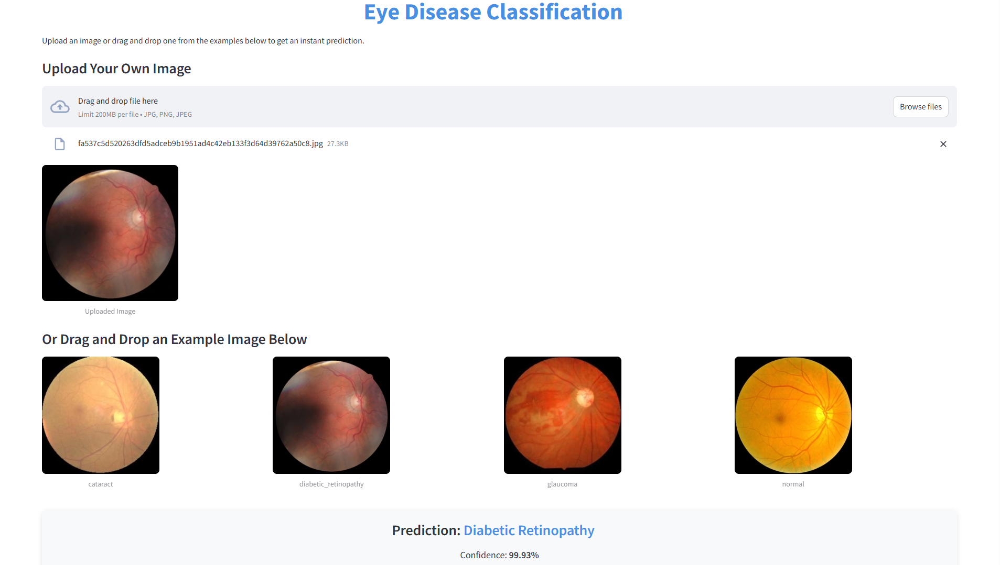

# Eye Disease Classification
This project leverages deep learning techniques to classify fundus images into four categories: cataract, diabetic retinopathy, glaucoma, and normal. Using a dataset of approximately 4,000 labeled images, the project aims to assist in early detection and diagnosis of eye diseases. Through exploratory data analysis, preprocessing, and rigorous model evaluation, the InceptionV3 architecture was fine-tuned to achieve an accuracy of 84%. The final model is deployed as an interactive application on the Hugging Face platform, providing a user-friendly tool for disease classification.

To quickly access the Streamlit interactive dashboard on the Hugging Face platform, use this link: 
- [https://huggingface.co/spaces/jihadakbr/eye-disease-classifier](https://huggingface.co/spaces/jihadakbr/eye-disease-classifier)

---

## Table of Contents
1. [Dataset Overview](#dataset-overview)
2. [Project Background](#project-background)
3. [Business Objective](#business-objective)
4. [Data Understanding](#data-understanding)
5. [Data Preprocessing](#data-preprocessing)
6. [Findings and Results](#findings-and-results)
7. [Dashboard](#dashboard)
8. [License](#license)
9. [Contact](#contact)

---

## Dataset Overview

| **Disease**          | **Description**                                                                                                                                                             |
|-----------------------|-----------------------------------------------------------------------------------------------------------------------------------------------------------------------------|
| **Cataract**         | In fundus photos, cataracts aren’t directly visible as they affect the lens, which is in the front of the eye. Severe cases might show a white or cloudy lens in retinal photos. |
| **Diabetic Retinopathy** | This condition appears as small red spots (microaneurysms) or larger areas of bleeding in the retina. Yellowish spots (exudates), swelling, or abnormal vein growth may also be present. |
| **Glaucoma**         | Seen as damage to the optic nerve, often appearing as a larger "cup" or hollow space in the optic nerve. Thinning of the retinal nerve fiber layer may result in a pale or indistinct optic disc. |
| **Normal**           | A healthy retina appears with a clear optic nerve, smooth blood vessels, no signs of bleeding or swelling, and a normal optic disc with a small central "cup."              |

Link to the Streamlit interactive dashboard on the Hugging Face platform: 
- [https://huggingface.co/spaces/jihadakbr/eye-disease-classifier](https://huggingface.co/spaces/jihadakbr/eye-disease-classifier)

---

## Project Background

This project focuses on a dataset of fundus images used to detect and classify eye diseases. These diseases—cataract, diabetic retinopathy, glaucoma, and normal conditions—can significantly impact vision and quality of life. Early detection and accurate classification are critical in ensuring timely medical intervention. This dataset offers a valuable resource for applying and refining deep learning techniques to automate disease detection and analysis.

---

## Business Objective

1. Perform exploratory data analysis (EDA) on the eye disease classification dataset to identify patterns and insights.
2. Develop a deep learning-based classification model to accurately identify and differentiate between cataract, diabetic retinopathy, glaucoma, and normal eye conditions.

---

## Data Understanding

- **Source**: The dataset was collected from Kaggle.
- **Size**: Approximately 4,000 images distributed across four classes.
- **Categories**: Includes images labeled as cataract, diabetic retinopathy, glaucoma, and normal.

---

## Data Preprocessing

Exploratory data analysis and preprocessing steps were conducted to ensure data quality and optimize model performance:

### Key Tasks
- **Dataset Evaluation**:
  - Checked dataset structure.
  - Identified and removed corrupted or duplicate images.
  - Analyzed image formats, sizes, and quality (e.g., blurry, overexposed, underexposed, or noisy images).
- **Preprocessing Steps**:
  - Removed duplicates.
  - Converted image formats.
  - Resized images to a consistent dimension.
  - Split the dataset into training, validation, and test sets.
  
### Model Development
1. **Baseline Model**:
   - Implemented a simple CNN architecture to establish baseline accuracy.
2. **Comparative Analysis**:
   - Evaluated deeper architectures, including InceptionV3, VGG16, and RNN.
   - Achieved the highest accuracy with InceptionV3.
3. **Model Optimization**:
   - Fine-tuned InceptionV3 by unfreezing pre-trained layers.
   - Added early stopping to prevent overfitting.
   - Conducted hyperparameter tuning with Keras Tuner, optimizing dense layer units to 512.
4. **Performance**:
   - Final model achieved 84% accuracy, 84% precision, 83% recall, and 84% F1 score.

---

## Findings and Results

- **Best Model**: InceptionV3 emerged as the most accurate architecture with 84% overall accuracy.
- **Model Improvement Techniques**:
  - Fine-tuning pre-trained layers.
  - Early stopping for overfitting mitigation.
  - Hyperparameter optimization.
- **Deployment**: The final model was deployed using Streamlit on the Hugging Face platform, providing a user-friendly interface for predictions.

---

## Dashboard

---

## License

This project is licensed under the [Creative Commons Attribution-ShareAlike 4.0 International License](LICENSE).

---

## Contact

For questions or collaborations, feel free to reach out:

- **Email**: [jihadakbr@gmail.com](mailto:jihadakbr@gmail.com)
- **LinkedIn**: [linkedin.com/in/jihadakbr](https://www.linkedin.com/in/jihadakbr)
- **Portfolio**: [jihadakbr.github.io](https://jihadakbr.github.io/)
